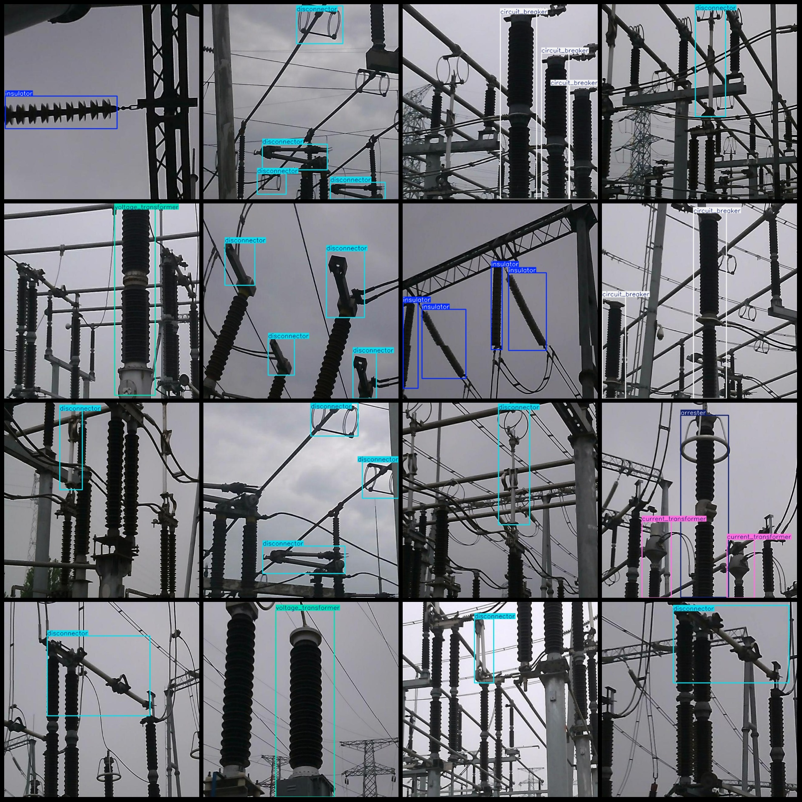
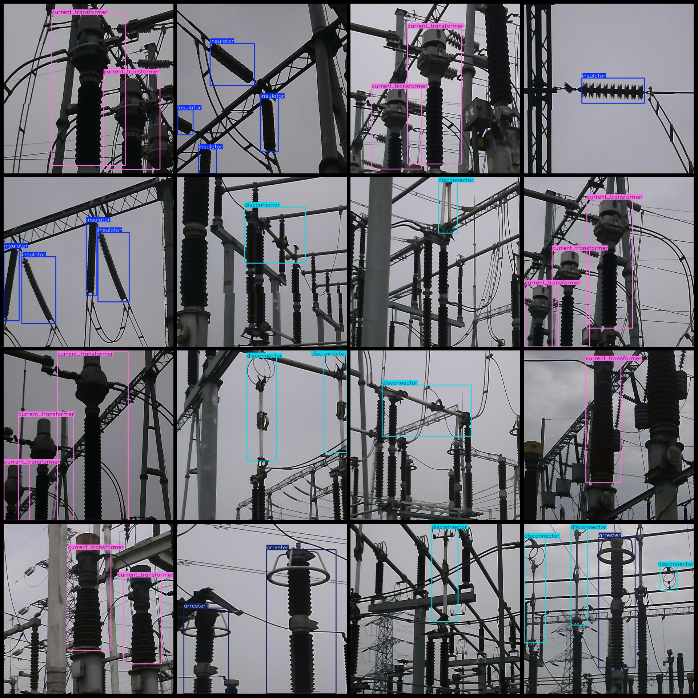

# Power Scene Device Detection Vision-Based Object Detection Dataset with VOC+YOLO format and 633 images in 7 classes

Dataset format: Pascal VOC format + YOLO format (txt files without split paths, only contain jpg images and corresponding VOC format xml files and yolo format txt files)
number of images: 633  
Number of XML files: 633
annotation count: 633  
Labeling category number: 7
["arrester", "bushing", "circuit_breaker", "current_transformer", "disconnector", "insulator", "voltage_transformer"]
The number of boxes labeled in each category:
"Arreter Frame Count = 117"
Bushing (core) Frame Count = 80
circuit_breaker box count = 166
current_transformer (current transformer) Frames = 160
Disconnector (isolation switch) frame count = 419
insulator Frame Count = 184
Voltage transformer (voltage transformer) Frame count = 46
total boxes: 1172  
images per class:   
Arrester images = 88
Bushing images = 41
Circuit Breaker occupies a picture count of 78.
"current_transformer" = "current transformer"
Disconnector (Isolater) images = 242
Insulator (Insulator) occupies 79 pictures.
Voltage transformer (Voltage transformer) images = 40
Image resolution: 640x640
Use annotation tool: labelImg
Annotation rules: draw a rectangle around the class.
Important Notice: The dataset does not have split into training validation test sets. Please do it yourself.
Special statement: This dataset does not guarantee the accuracy of the trained model or weight file.
Image preview:
## Images

Here is a pay link on Stripe ( https://buy.stripe.com/3cs8yP7sY87d0vu9AB ). Please contact me lonlonago@foxmail.com after funding $89, and I will send you a complete data files , thank you!

